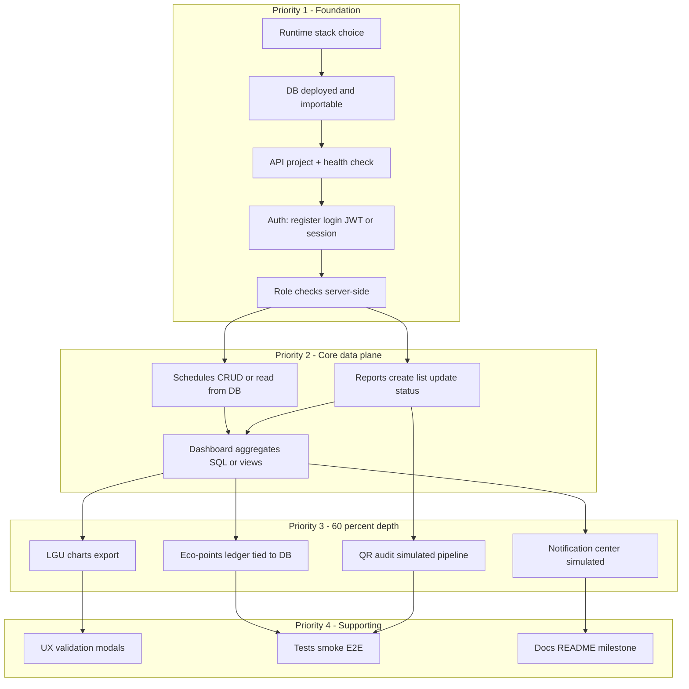

# BAGO.PH — Improvements Roadmap to ~60% Milestone Progress

**Document purpose:** Single reference for what to build next, in **priority order**, so the project can credibly move from the **documented 30% baseline** toward a **~60% course milestone**.  
**Audience:** Team (CEO/COO/CTO/CPO), instructor review, demo prep.  
**Scope note:** Official percentage weighting lives with the **course rubric**; this document translates repository reality + `README.md` gaps into an actionable backlog. Align line items to your grading sheet and adjust labels (must-have vs nice-to-have) accordingly.

---

## 1. Baseline and target

### 1.1 What “30%” means in this repository

Per `README.md` and `package.json`, the submitted baseline includes:

- Static **HTML/CSS** app with **role-based navigation** (`html/role-access.js`, `localStorage` session).
- **XML + XSLT** for schedules and barangays; **interactive editors** with filter/sort/CRUD, export, and browser persistence.
- **`sql/bago_ph_database.sql`** — full **DDL** (eight core tables), **seed data**, and **example DML** (read + write samples).
- **Post–30% additions** documented under *Progress Since the 30% Milestone* (login/register flows, 72 Lipa barangays, SQL file structure, etc.).

### 1.2 What is still explicitly “not there”

The README *Cannot Do Yet* and *Future / Missing Improvements* sections state the main gap: **no server API**, **no live database connection from the web pages**, **no server-side authentication**, and several **feature-depth** items (eco-points, QR, LGU charts, notifications) called out for later milestones.

### 1.3 What “~60%” should represent (working definition)

For milestone planning, treat **~60%** as:

- **Demonstrable vertical slice:** at least one **end-to-end path** where **browser → API → database** works for core entities (not only `localStorage`).
- **LGU-facing value visible:** **dashboard metrics** backed by **real or seeded DB data** (charts or summary cards with query-backed numbers).
- **Depth on 2–3 feature pillars** (recommended: **reports + schedules + one of eco-points or compliance/QR audit**), not shallow stubs everywhere.
- **Documentation and demo script** updated so reviewers see **60%** as justified (README milestone text, setup steps, what is mock vs live).

If the instructor uses a strict checklist, **replace Section 4 acceptance criteria** with rubric rows—this document stays the engineering backlog.

---

## 2. Principles for prioritization

1. **Unblock data truth first** — Without a **persistent store** and **API**, most “LGU operations” stories stay fiction. Highest priority: **minimal backend + DB wiring** aligned with existing SQL schema.
2. **Match existing schema** — `sql/bago_ph_database.sql` already models barangays, residents, collectors, schedules, waste reports, eco-points transactions, QR codes, LGU admins. Prefer **implementing tables that exist** over inventing parallel JSON in `localStorage`.
3. **Prototype-grade security is OK at 60%** — Hashed PINs, basic session or JWT, HTTPS in deployment notes—**not** full RA 10173 production compliance unless rubric demands it.
4. **“Production-grade” from README** (full OAuth, hardware QR, real push) — **defer** or **simulate** unless rubric explicitly requires; substitute **traceable simulations** (audit log table, in-app notification center).
5. **Demo reliability** — One **repeatable** path: install DB → run API → open app → show live data. Worth more than scattered half-features.

---

## 3. Dependency overview (read before implementation order)

---

## 4. Priority 1 — Foundation (must-have for ~60%)

These items **directly address** the largest README gap: *no server API or database connection from HTML pages*.

### 4.1 Runtime and repository layout

| ID | Improvement | Detail | Suggested acceptance criteria |
|----|-------------|--------|--------------------------------|
| P1.1 | **Choose stack** | Pick one path and document it: e.g. **Node (Express/Fastify) + MySQL/MariaDB**, or **serverless + managed DB**, or **Supabase/Postgres** if aligning with `prompt/web-feats_doc.md` long-term. | Decision recorded in README or `docs/`; versions pinned; one “happy path” install doc. |
| P1.2 | **Separate `server/` or `api/`** | API code lives outside `html/`; CORS and env-based config for local dev. | `npm run dev` (or equivalent) starts API; `/health` returns 200. |
| P1.3 | **Environment configuration** | `.env.example` with `DATABASE_URL`, `JWT_SECRET` or session secret, `PORT`; no secrets in git. | New clone works with copy-paste env steps. |

### 4.2 Database deployment and parity with `bago_ph_database.sql`

| ID | Improvement | Detail | Suggested acceptance criteria |
|----|-------------|--------|--------------------------------|
| P1.4 | **Import script** | One command or documented steps to create DB and load **Section A + B** minimum. | Fresh DB matches schema; seed rows queryable. |
| P1.5 | **Migration strategy (minimal)** | Either SQL migrations folder or “single source” DDL maintained—avoid drift between hand-edited DB and repo file. | Schema in repo = schema running locally. |
| P1.6 | **Seed data for demo** | Enough rows for **dashboards** and **reports list** (multiple barangays, reports in varied statuses). | Demo does not look empty after cold install. |

### 4.3 Authentication and authorization (server-backed)

| ID | Improvement | Detail | Suggested acceptance criteria |
|----|-------------|--------|--------------------------------|
| P1.7 | **Register/login API** | Map mobile + PIN (or email + password for LGU-only web—align with schema `residents.pin_hash` / `lgu_admins.email`) to **hashed credentials**; issue **session cookie** or **JWT**. | New user can register; returning user can login; invalid PIN rejected. |
| P1.8 | **Server-side role enforcement** | Roles (`user` \| `collector` \| `lgu_officer`) enforced on **API routes**, not only `role-access.js` hiding links. | Direct `fetch` to forbidden endpoint returns **401/403** even if HTML nav is bypassed. |
| P1.9 | **Bridge frontend session** | Replace or augment pure `localStorage` role with token/cookie the SPA/static pages send on API calls; keep UX (logout clears server session). | Logout invalidates access; refresh behavior documented. |

### 4.4 Minimal API surface (first vertical slice)

| ID | Improvement | Detail | Suggested acceptance criteria |
|----|-------------|--------|--------------------------------|
| P1.10 | **CRUD subset** | Implement APIs for **at least**: `collection_schedules` (read + create/update for LGU), `waste_reports` (create + list + status update), `barangays` (read list for dropdowns). | Postman/curl examples in README; IDs stable after restart. |
| P1.11 | **Frontend integration** | Wire **schedule** and **report** pages to API instead of only static/demo data where feasible. | User-visible actions persist after page reload. |

**Rationale:** Priority 1 alone turns the project from “static prototype” into “working thin product slice”—typically the strongest signal for moving **30% → ~60%** in software project grading.

---

## 5. Priority 2 — LGU dashboard and analytics (high value for demos)

README lists **LGU analytics charts (live charts)** as a later milestone item. For ~60%, **live** means **fed from DB/API**, not necessarily real-time GPS.

| ID | Improvement | Detail | Suggested acceptance criteria |
|----|-------------|--------|--------------------------------|
| P2.1 | **Dashboard metrics endpoint** | Aggregate queries (or materialized views) for: open reports count, schedules today, compliance proxy, eco-points monthly totals—aligned to `README` feature overview cards. | LGU dashboard numbers change when DB seed changes. |
| P2.2 | **Charts library** | Add charts (e.g. Chart.js, Apache ECharts) on `dashboard-lgu.html` (or successor SPA page) bound to API JSON. | At least **2 chart types** (e.g. bar + line or doughnut) with real data. |
| P2.3 | **Export** | CSV or PDF export for **one** report type (e.g. waste reports date range or DENR-style summary). | Download works; file opens; documents field list. |
| P2.4 | **Last updated timestamp** | Display server-side “data as of” time on dashboard (from query or server clock). | Visible on demo path. |

---

## 6. Priority 3 — Feature depth (pick 2–3 tracks for ~60%)

README “later milestone” list: **eco-points**, **QR**, **notifications**. For ~60%, implement **depth**, not production hardware.

### 6.1 Eco-points (deeper wallet)

| ID | Improvement | Detail | Suggested acceptance criteria |
|----|-------------|--------|--------------------------------|
| P3.1 | **Ledger backed by `eco_points_transactions`** | All point changes create rows; resident balance derived or stored consistently per schema. | History list matches balance; no orphan transactions. |
| P3.2 | **Redemption flow (prototype)** | Simple “redeem reward” action deducts points with reason code; optional admin approval endpoint. | End-to-end demo: earn → redeem → see ledger. |

### 6.2 QR audit (simulated pipeline)

| ID | Improvement | Detail | Suggested acceptance criteria |
|----|-------------|--------|--------------------------------|
| P3.3 | **QR validate API** | Accept scanned code string; validate against `qr_codes` table; write scan event (extend schema if needed with migration). | Invalid vs valid paths demonstrable. |
| P3.4 | **Collector / LGU UI hook** | `qr-audit.html` loads last N events from API; shows barangay + timestamp. | No claim of hardware integration unless required. |

### 6.3 Notifications (simulation)

| ID | Improvement | Detail | Suggested acceptance criteria |
|----|-------------|--------|--------------------------------|
| P3.5 | **In-app notification feed** | Table `notifications` or reuse announcements with `user_id` targeting; API list + mark read. | Schedule change creates notification; user sees list. |
| P3.6 | **Optional email/SMS stub** | Log-only provider in dev; document production provider swap. | Rubric asks “simulation”—console log + UI enough. |

**Recommendation:** If time-constrained, prioritize **P3.1 + P3.3** *or* **P3.1 + P3.5** before spreading thin.

---

## 7. Priority 4 — UX, quality, and documentation (supporting ~60% credibility)

| ID | Improvement | Detail | Suggested acceptance criteria |
|----|-------------|--------|--------------------------------|
| P4.1 | **Replace `prompt()` in XML editors** | Modals/forms per README *Future / Missing* | No blocking browser prompts in editor flows. |
| P4.2 | **Form validation** | Mobile, PIN, barangay: client + server validation; consistent error messages. | Invalid submissions never create partial DB rows. |
| P4.3 | **Smoke tests** | Minimal automated test: API health + one authenticated request; optional Playwright for login path. | CI or `npm test` runs green locally. |
| P4.4 | **README milestone update** | New section **“Features completed (~60%)”** listing: backend, DB live, dashboards, which P3 tracks done. | Instructor can verify claims against repo. |
| P4.5 | **`package.json` description** | Update milestone string when group agrees ~60% is reached. | Matches README. |

---

## 8. Priority 5 — Defer past ~60% unless rubric demands

These are valuable but **low ROI** for hitting **60%** if foundation is unfinished:

- Full **OAuth**, **account lockout**, **IP audit** as in `prompt/web-feats_doc.md` Feature 1 (unless course requires parity).
- **Production** RA 10173 compliance, **HTTPS** on public internet, **monitoring/backups** (note as future work).
- **React rewrite** + **Supabase** full parity with mobile—major scope; treat as **Phase 2** unless milestone explicitly requires stack match.
- **Push notifications** to real devices—use **P3.5** simulation first.
- **Interactive sorting inside raw XSLT output**—README already defers; keep using HTML editors.

---

## 9. Suggested execution sequence (concise)

| Phase | Focus | Exit signal |
|-------|--------|-------------|
| **A** | P1.1–P1.6 DB + API shell + import | DB + `/health` + seeded data |
| **B** | P1.7–P1.9 auth | Login/register against DB |
| **C** | P1.10–P1.11 schedules + reports API + HTML wiring | Persistent user-visible CRUD |
| **D** | P2.1–P2.4 LGU dashboard + charts + one export | Demo “wow” for officers |
| **E** | P3.x two depth tracks | Eco-points and/or QR and/or notifications |
| **F** | P4.x polish + README + tests | Repeatable demo + updated milestone % |

Parallel tracks: **DBA** owns import/migrations/seed; **frontend** owns API client + dashboard charts; **docs** updated continuously.

---

## 10. Traceability: README gaps → this document

| README section | Primary improvement IDs |
|----------------|-------------------------|
| *Cannot Do Yet* — no server API / DB | P1.2, P1.4, P1.10, P1.11 |
| *Cannot Do Yet* — no real identity / hashed PIN | P1.7, P1.8 |
| *Originally planned for later* — eco-points depth | P3.1, P3.2 |
| *Originally planned for later* — LGU analytics charts | P2.1, P2.2 |
| *Originally planned for later* — QR verification | P3.3, P3.4 |
| *Originally planned for later* — push notification simulation | P3.5, P3.6 |
| *Future* — modals, validation | P4.1, P4.2 |
| *Future* — automated tests | P4.3 |

---

## 11. Risk register (short)

| Risk | Mitigation |
|------|------------|
| Rubric % does not match engineering effort | Early **instructor alignment**; map rubric rows to IDs in Section 4–7. |
| Scope creep to “full production” | Timebox **Priority 1–2** before **Priority 3**. |
| Team split-brain on stack | **P1.1** decision doc + single `CONTRIBUTING` or `docs/ARCHITECTURE.md` (optional follow-up). |

---

## 12. Document maintenance

- Update this file when **Priority 1** stack choice is final and when **major IDs** complete.
- After course submission of ~60%, archive snapshot (commit hash) in README *Notes* if required.

---

*Generated for BAGO.PH repository context (FreeElective 1 | Technopreneurship, IT3B). Adjust IDs and wording to match official course deliverables.*
